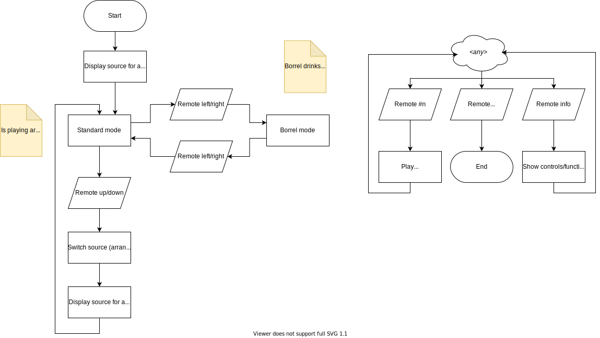

# StoKa-TV
Promotional display in the StoKa.  
(Will replace [STORMTV](https://github.com/StudieverenigingSTORM/STORMTV))

## General
This document contains general documentation, such as diagrams, about this project.

### System overview
Concept for the deployment of the different components of the solution. (Different deployments may be possible)

### TV application
The TV application constitutes the public part of the solution.
It has limited interactivity.
Content cannot be authored through this application.
This application is also available in the browser to preview7review the content.

### Content Management

## Prerequisites
+ [GNU Make](https://www.gnu.org/software/make/)
+ [Docker](https://hub.docker.com/search?offering=community&q=&type=edition&platform=desktop%2Cserver) and [Docker Compose](https://docs.docker.com/compose/install/)

## Backend
To build and start the backend run `make debug-containers`.

## Debugging
You can debug containers using the Crome DevTools by going to `chrome://inspect`.  
To debug the API in Visual Studio Code, use the launch configuration "Debug API" after starting the containers to attach the debugger. This will restart the process.
