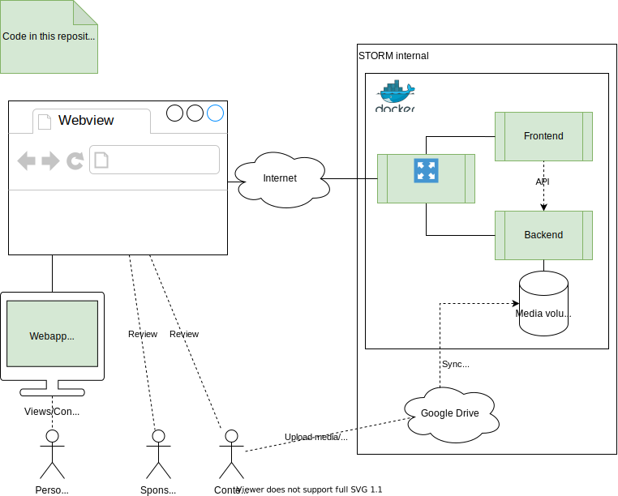

# StoKa-TV 📺
Promotional display in the StoKa.  
(Will replace [STORMTV](https://github.com/StudieverenigingSTORM/STORMTV))

## General
This section contains general documentation, such as diagrams, about this project.

### System overview
Concept for the deployment of the different components of the solution. (Different deployments may be possible)



### TV application
The TV application constitutes the public part of the solution.
It has limited interactivity.
Content cannot be authored through this application.
This application is also available in the browser to preview/review the content.


### Content Management


## Prerequisites
+ Linux (Do all of us a favor and use a real operating system 🙃)
+ [Bash](https://www.gnu.org/software/bash/)
+ [GNU Make](https://www.gnu.org/software/make/)
+ [Docker Engine](https://docs.docker.com/engine/install/) and [Docker Compose](https://docs.docker.com/compose/install/)
+ ([Tizen TV Emulator](https://developer.samsung.com/smarttv/develop/getting-started/using-sdk/tv-emulator.html) for testing without a physical device)

## Running the web application locally
To build and start the web application run `make debug-containers`.  
Then navigate to http://localhost:8080.

## Deploying the web application
The following optimizations should be performed before deploying the web application into production:
* Optimize layers of docker images (use [multi-stage builds](https://docs.docker.com/develop/develop-images/multistage-build/))
* Remove nodemon in backend image (see `/backend/Dockerfile`)
* Remove volumes mounting code from host (see `/compose.yaml`)
* Securely connect to reverse-proxy (TLS termination)
* Replace frontend dependencies with minified versions (see `/frontend/download-dependencies.sh`)
* Enabled caching for frontend (see `/frontend/nginx.conf`)
* Remove API documentation (see `/compose.yaml` and `/reverse-proxy/nginx.conf`)

⚠ Review the contents of `.env`!

## Installing the application
1. Copy `/app/config.js.example` to `/config.js/`
2. Set frontend base url in `/app/config.js.example`
3. Connect to the same network as the TV
4. Run `make install-app TARGET="<IP address of TV>"`  
(I have not yet tested this, but it should work 🙃)  
⚠ When using the TV emulator, you should load and run the project through Tizen Studio instead.

## Debugging
You can debug the API container using the Crome DevTools by going to `chrome://inspect`.  
To debug the API in Visual Studio Code, use the launch configuration "Debug API" after starting the container to attach the debugger. This will restart the process.

## API
The API documentation is contained in the file `/docs/openapi.yaml` can be tested through the interactive documentation running on http://localhost:8080/docs/.

## Content
The backend should mount a directory containing the content that should be served by the application (see `/compose.yaml`).  
Content can be synchronized to this directory from cloud storage using [rclone](https://rclone.org/).

Each subdirectory within this directory is treated as an arrangement that can be played in the application.
Directories starting with `.` are "hidden" (e.g. for review) and are not listed in the API, but can still be accessed if the name of the directory is known. Prefix the name of the directory with a digit followed by an underscore to map it to the corresponding button on the remote (e.g. `1_first-arrangement, 2_second-arrangement, ...`).

By default, all JPEG, PNG and MP4 files are played in alphabetical order.
An explicit order can be defined by creating `arrangement.yaml` in this directory which defines the title of the arrangement and the order and duration of the content.  
Example:
```yaml
# Lines starting with # are comments and are ignored
# Please make sure to produce a valid YAML file (see https://yaml.org/)
# Mind special characters and indentation!

# Title of the arrangement that may be displayed
title: "Main"
items: # List of 
- file: bunny.mp4
  # Optional duration in seconds
  duration: 10
- file: pic1.jpg
  # If duration is not present, the default duration is used
  # (Video length for videos and 5 seconds for images)
```

Place an image with the name `borrel-menu` into the root of the content directory to use as the borrel menu.

To get started, copy `/media.example/` to `/media/`.  
(⚠ The example content is not licensed under the same license as the code.)

## Controls
| Function | App | Web browser |
|---|---|---|
| Next arrangement | ◀ | `Arrow Right` |
| Previous arrangement | ▶ | `Arrow Left` |
| Toggle borrel menu | 🔼 | `Arrow Up` |
| Toggle help pop-up | _i_ | `i` |
| Select arrangment | 0-9 | `0`-`9` |
